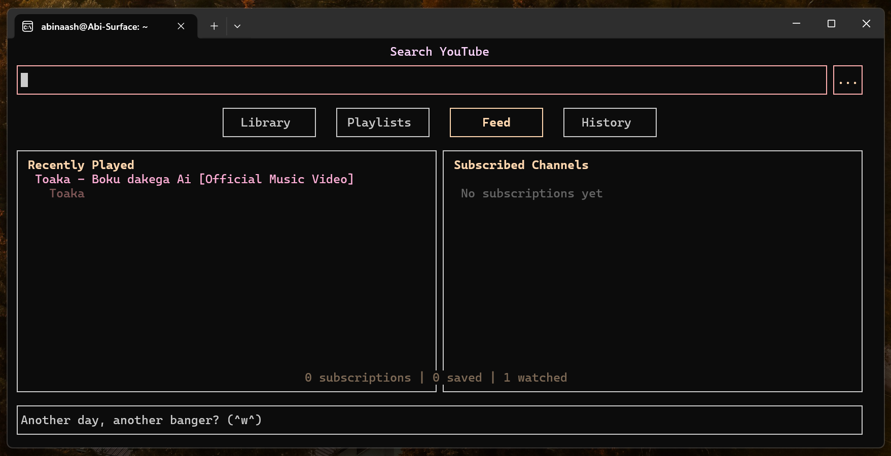
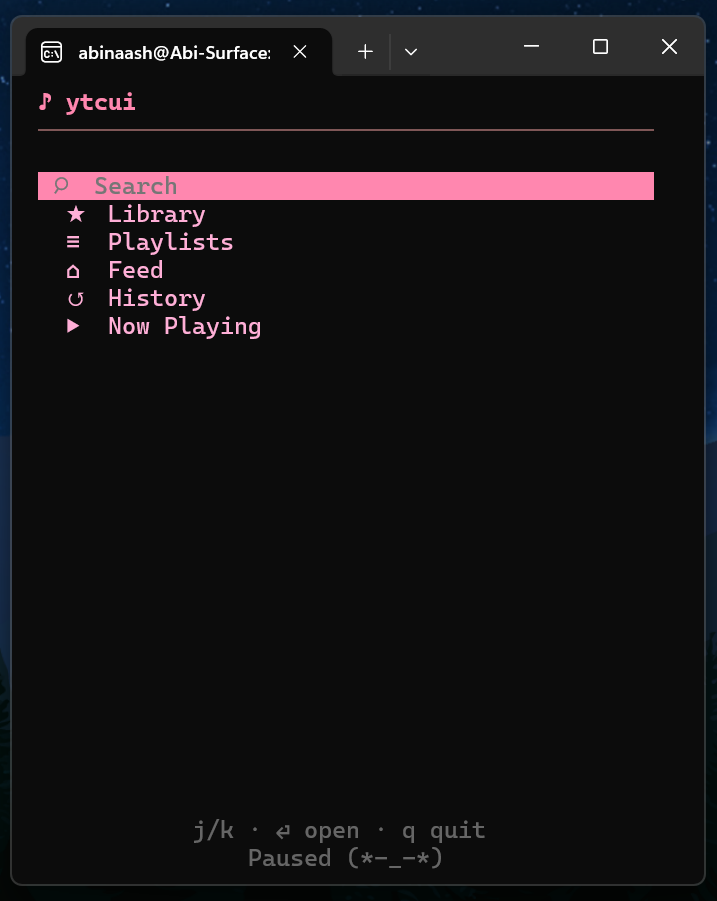
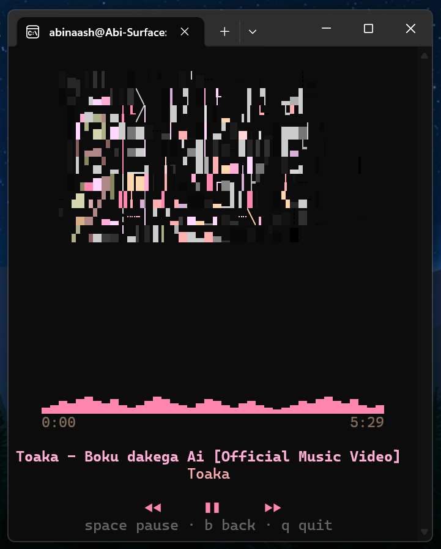

# ytcui (=^･ω･^=)

A fast, beautiful terminal YouTube client — search, play, and manage videos without leaving your shell.

Built in C++ with ncurses. Plays via **mpv**, fetches via **ytcui-dl** (built-in) or **yt-dlp**.



> ytcui running in Windows Terminal under WSL. >_<

---

<p align="center">
  
  
</p>

> ytcui in streamlined view >_O

---

## Install

```bash
git clone https://github.com/MilkmanAbi/ytcui.git && cd ytcui && sh install.sh
```

> 3.5.2 is unforunately a breaking update since the Install System has been replaced and updated to OIS, manually uninstalled older versions may be required via uninstalling the binary. Fortunately, ytcui updates >3.5.2 will be non breaking with OIS handling clean rebuilds hereby.

Installation is handled by [OneInstallSystem (OIS)](https://github.com/MilkmanAbi/OneInstallSystem):
it detects your OS and package manager, installs the right dependencies
(verified per-distro), builds from source, and installs to your PATH. Manage it
afterwards with:

```bash
ytcui --ois            # status + update panel
ytcui --update         # update to the latest version
ytcui --reinstall      # clean rebuild from source
ytcui --uninstall      # remove cleanly (with a generated uninstaller)
ytcui --install-info   # full install details + dependency status
```

### Supported Platforms

| Platform | Package Manager | Notes |
|----------|----------------|-------|
| **Linux** | apt, pacman, dnf, yum, zypper, apk, emerge, xbps | Full support |
| **macOS** | Homebrew or MacPorts | Auto-installs either if needed |
| **FreeBSD** | pkg | Native `procctl` support |
| **WSL2** | (same as Linux) | Works great |

---

## What's new in >v3.5.2

**Rock-solid now** — the teardown crash some terminals hit on quit (a heap use-after-free from detached worker threads outliving the curl client) is gone, and every AddressSanitizer / undefined-behaviour issue found since 3.0.0 has been fixed. Quitting, fast searching, and rapid navigation are all clean under ASan.

**One-command install (OIS)** — `sh install.sh` builds from source and installs across Linux, macOS and the BSDs via [OneInstallSystem](https://github.com/MilkmanAbi/OneInstallSystem). It detects your OS and package manager (apt, pacman, dnf, yum, zypper, apk, emerge, xbps, brew, macports, pkg), resolves the right *development* packages (verified per-distro, checked with pkg-config so a runtime CLI is never mistaken for build headers), and registers a clean uninstaller. Manage it afterwards with `ytcui --update`, `--reinstall`, `--uninstall`, `--install-info`, and `--ois`. The installer asks a few setup questions up front: backend (ytcui-dl / yt-dlp), streamlined mode, thumbnails, and theme.

**Streamlined mode** — on very narrow terminals ytcui automatically switches to a dense, themed, minimalist music-player UI: an iPod-style section menu (Search · Library · Playlists · Feed · History), compact lists, a Play video / Play audio chooser, and a now-playing card with album-art thumbnail, waveform, time and transport controls. It's conservative — the default is always the full UI, and it only switches when the terminal reports a reliably narrow width. Force it with `--mode auto|normal|streamlined`.

**Real terminal detection** — instead of guessing from `$TERM`, ytcui now identifies the terminal at startup with a batched, timeout-bounded query handshake (XTVERSION, XTGETTCAP, DA1/DA2/DA3) plus environment and live terminfo, then adapts: truecolor / 256 / 16-colour tiers, sixel/kitty/iterm graphics support, native block-glyph support, and **cell-pixel size detection** for correctly scaled images. Minimal emulators that don't answer degrade safely rather than hanging. Mouse input is enabled only where it's actually supported (no more stray bytes on the Linux console), and `ytcui --diag` prints the full capability report.

**Cleaner highlighting** — the selected row/tab/menu item now uses a proper full-width foreground/background bar painted with explicit spaces, with an auto-contrasting text colour, instead of reverse-video over a default background. It renders consistently across terminals (no more partial or invisible highlights), and falls back to reverse video only on sub-8-colour terminals.

**Terminal robustness** — resizing is handled cleanly (no stale cells), CJK and wide-character titles size correctly by display columns, and layout-breaking code points (control, BiDi-override, zero-width) in YouTube titles are stripped so they can't scramble a line.

**Playlists** — create named playlists, add videos from search results or history, reorder, remove, copy between playlists. Stored locally and persists across sessions.

**ytcui-dl** — a built-in InnerTube client that replaces yt-dlp entirely. Talks directly to YouTube's mobile API. Search results appear near-instantly, stream URLs are prefetched in the background while you browse. No Python, no subprocess overhead.

**18 themes** with per-element colour customisation — override any UI element's colour on top of any theme, all configurable in `config.json`.

> Note: ytcui-dl is very much new, I'm completely rewriting it, just slowly... Currently, ytcui-dl is not suitable if you prioritise video quality. I'm adding a lot of features to ytcui-dl, support up to 2k video on PCs, possibly 4k (still figuring stuff out). Audio should go from 128kbps to 160kbps in a future release, actively fixing bugs.
> 
---

## Keys

| Key | Action |
|-----|--------|
| `j` / `k` | Navigate up / down |
| `h` / `l` | Navigate left / right (tabs, menus) |
| `Tab` | Cycle panel focus |
| `Enter` | Select / open action menu |
| `Esc` | Back / re-search from Results |
| `/` | Jump to search |
| `p` | Pause / resume (global) |
| `s` | Sort & filter |
| `n` | New playlist (in Playlists tab) |
| `g` / `G` | Jump to top / bottom of results |
| `q` | Quit |

Mouse works everywhere — click tabs, result rows, action items, info panel, scroll wheel navigates.

---

## Tabs

| Tab | What's there |
|-----|-------------|
| **Library** | Subscriptions (left) + saved videos (right) |
| **Playlists** | All your playlists — open, create, manage |
| **Feed** | Recently watched + subscribed channels |
| **History** | Everything you've played — click any title to search it |
| **Results** | Your last search, always accessible while music plays |

---

## Streamlined mode

On very narrow terminals ytcui automatically switches to a dense, minimalist
music-player layout that follows your theme colours:

- An iPod-style section menu mirroring the normal tabs — **Search · Library ·
  Playlists · Feed · History** (plus Now Playing) — navigate with `j`/`k` and
  `Enter`.
- Each section opens a compact list (title + channel · duration); selecting an
  item gives a **Play video / Play audio** chooser.
- A now-playing card with album-art thumbnail, waveform, time, title/artist and
  transport controls. `space` pauses, `b`/`Esc` goes back, `q` quits.

It's conservative: the default is always the full UI, and it only switches when
the terminal reports a reliably narrow width. Force it either way:

```bash
ytcui --mode streamlined   # always the music-player UI
ytcui --mode normal        # always the full UI
ytcui --mode auto          # default: switch when narrow
```

You can also set `"mode"` to `auto`/`normal`/`streamlined` in the config file —
or just pick it during `sh install.sh`, which asks for the backend
(ytcui-dl / yt-dlp), streamlined mode, and thumbnails up front.

---

## Usage

```bash
ytcui                      # launch
ytcui -t pink              # sakura theme
ytcui -t dracula           # dracula theme
ytcui --gfx sixel          # real-image thumbnails (sixel/kitty/iterm/blocks/auto/off)
ytcui --colors             # list all colour elements + config example
ytcui --debug              # enable debug logging
ytcui --debug --logdump    # full mpv output logging
ytcui --upgrade            # upgrade to latest version
ytcui --diag               # full system diagnostic
ytcui --help               # help
ytcui --version            # version
```

---

## Themes

Ten new soft pastel themes joined the classics in v3.0.0:

| Theme | Vibe |
|-------|------|
| `default` | Clean terminal colours |
| `dracula` | Deep purples and crimson. Creature of the night |
| `nord` | Arctic blues and soft greys. Nordic winter calm |
| `tokyo` | Neon city rain at midnight |
| `gruvbox` | Warm wood and amber. Retro cosiness |
| `monokai` | Vivid syntax colours. The classic dev palette |
| `solarized` | Precision-tuned tones. Easy on the eyes all day |
| `pink` | Soft sakura blossoms and blush petals at dawn |
| `purple` | Wisteria and lavender fields in the late afternoon |
| `blue` | Powder sky, periwinkle haze, summer sea glass |
| `green` | Morning sage, honeydew, and botanical softness |
| `mint` | Cool spearmint foam and pale jade on a spring day |
| `ocean` | Pale turquoise coves and seafoam on still water |
| `coral` | Warm peach, apricot, and sun-kissed sandy blush |
| `amber` | Champagne fields, soft gold, and cornsilk warmth |
| `red` | Dusty rose, linen, the blush of a gentle sunset |
| `slate` | Cool steel mist and powder blue-grey at dusk |
| `grayscale` | No colour. Just shape, light, and shadow |

Switch anytime: `ytcui -t mint`

---

## Colour customisation

Override any UI element on top of any base theme. Add a `"colors"` block to your config:

```json
{
  "theme": "dracula",
  "colors": {
    "accent": 198,
    "title":  213,
    "border": 141
  }
}
```

Run `ytcui --colors` for the full element reference and a 256-colour chart link.

**Elements:** `bg`, `search_box`, `title`, `channel`, `stats`, `selected`, `action`, `action_sel`, `status`, `border`, `header`, `accent`, `tag`, `published`, `bookmark`, `desc`

---

## Backend: ytcui-dl vs yt-dlp

ytcui ships with two backends, chosen at install time (switchable by rebuilding):

| | ytcui-dl | yt-dlp |
|---|---|---|
| **Speed** | Near-instant | 2–5s per video |
| **Dependencies** | None (built-in) | Python + yt-dlp |
| **How it works** | InnerTube API (YouTube mobile) | JS player extraction |
| **Stability** | Experimental | Battle-tested |
| **Recommended** |  Yes | If ytcui-dl breaks |

The backend is baked in at compile time. Rebuild to switch:
```bash
make BACKEND=ytcuidl   # default
make BACKEND=ytdlp
```

---

## Config

`~/.config/ytcui/config.json`

```json
{
  "theme": "pink",
  "max_results": 15,
  "show_thumbnails": true,
  "colors": {}
}
```

Data lives in:
- `~/.config/ytcui/` — config
- `~/.local/share/ytcui/` — library, history, playlists
- `~/.cache/ytcui/` — thumbnails, debug log

---

## Building manually

```bash
make BACKEND=ytcuidl   # build with ytcui-dl (default)
make BACKEND=ytdlp     # build with yt-dlp
make SIXEL=libsixel    # optional: in-process sixel thumbnails via libsixel
make clean             # clean
```

**Thumbnails:** block art (the default) works on any 256-colour terminal.
Real-image thumbnails via a graphics protocol (sixel/kitty/iterm) are an
**experimental opt-in** since piped encoders can mis-size on some terminals:
enable with `ytcui --gfx sixel` (or `kitty`/`iterm`), and build
`make SIXEL=libsixel` for pixel-exact sixel. `--gfx auto` stays on block art but
tells you which protocol your terminal could try. Run `ytcui --diag` to see what
was detected. If a raster mode looks wrong, use `--gfx blocks`.

**Dependencies by platform:**

| Platform | Build deps | Runtime |
|----------|-----------|---------|
| Linux | `g++`, `make`, `libncursesw-dev`, `libcurl-dev`, `libssl-dev` | `mpv`, `chafa` |
| macOS | Xcode CLT, Homebrew/MacPorts `ncurses`, `curl`, `openssl@3` | `mpv`, `chafa` |
| FreeBSD | `clang++`, `gmake`, `ncurses`, `curl`, `openssl` | `mpv`, `chafa` |

`nlohmann/json` is bundled — no separate install needed.

---

## Updating

```bash
ytcui --upgrade
```

The updater clones the latest release, detects your current backend, rebuilds, and reinstalls — all in one command. The update script lives at `/usr/local/share/ytcui/update.sh`, so you don't need the original repo folder.

---

## Troubleshooting

**UTF-8 looks garbled** — set your terminal locale:
```bash
export LANG=en_US.UTF-8   # add to ~/.bashrc or ~/.zshrc
```

**Age-restricted videos fail** — use browser auth from the action menu (Login via browser cookies).

**macOS: `command not found: brew`** — after Homebrew installs, add to `~/.zshrc`:
```bash
eval "$(/opt/homebrew/bin/brew shellenv)"   # Apple Silicon
eval "$(/usr/local/bin/brew shellenv)"      # Intel
```

**Thumbnails are missing or broken** — check `chafa` is installed: `which chafa`. Run `ytcui --diag` for a full system check.

**Debug mode** — run `ytcui --debug --logdump` to capture detailed logs to `~/.cache/ytcui/`.

---

## License

MIT

---

*ytcui values simplicity over flashiness, portability over lock-in, and clean code over clever abstractions. It's a practical terminal client that aims to stay small, readable, and reliable — something you can actually open the source of and understand.*

*Made with (=^･ω･^=) and ncurses*

---

If you found like this, please 🌟 it, makes me feel fuzzy and nice inside. ૮ ˶ᵔ ᵕ ᵔ˶ ა
