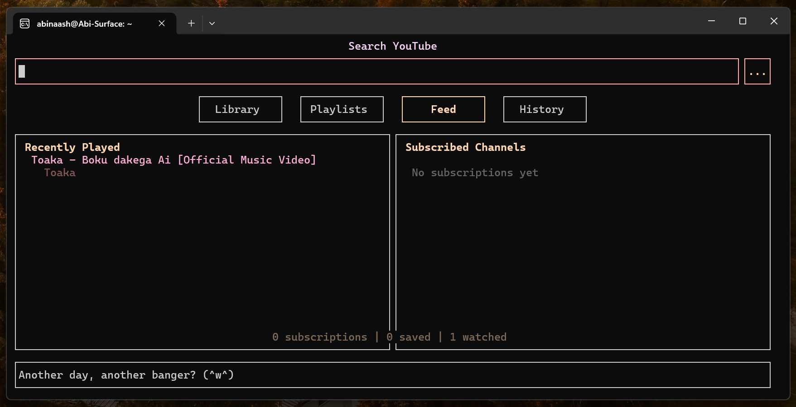
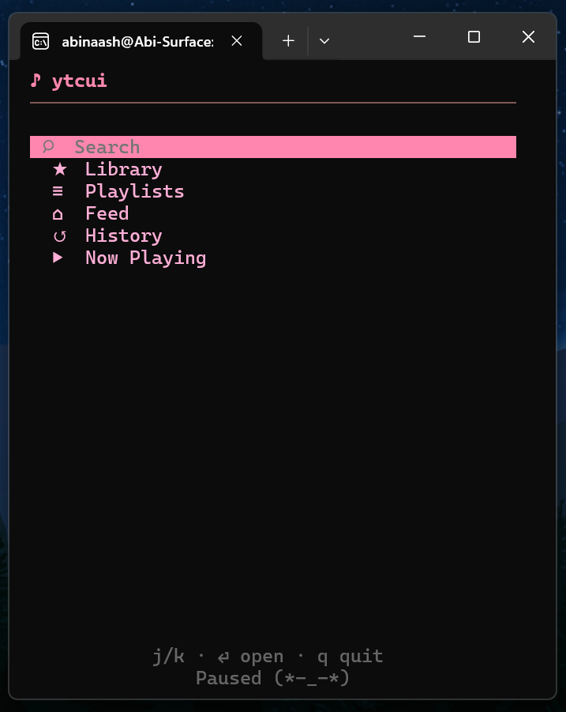
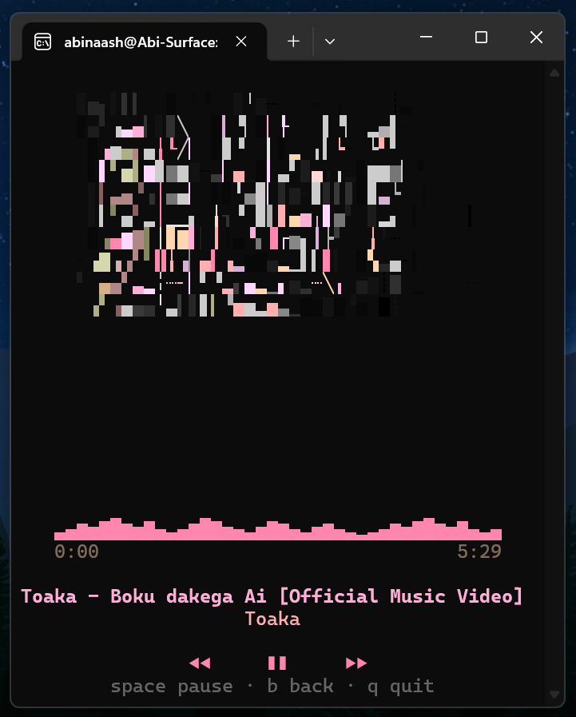

# ytcui (=^･ω･^=)

> UPDATED TO ytcui-dl v2!! Higher quality audio and video! Better macOS input handling!

A fast, beautiful terminal YouTube client — search, play, and manage videos without leaving your shell.

Built in C++ with ncurses. Plays via **mpv**, fetches via **ytcui-dl** (built-in, experimental YouTube client) or the mature **yt-dlp**.



> ytcui running in Windows Terminal under WSL. >_<

---

<p align="center">
  
  
</p>

> ytcui in streamlined view >_O

---

## ⚠️ 4.0.0 is a breaking update — manual migration required

**If you have ytcui < 4.0.0 installed, you must uninstall it manually before upgrading.** The install system changed from OIS v1 to OIS v4 and the two are not compatible. Find and delete the old binary (usually `/usr/local/bin/ytcui` or `~/.local/bin/ytcui`) and any leftover `~/.local/bin/.ytcui-ois` shim, then run the new installer fresh. Updates *from* 4.0.0 onward are handled cleanly by OIS with no manual steps. OIS v4 onwards are backwards compatible, handling updates cleaner and safer.

---

## Install

```bash
git clone https://github.com/MilkmanAbi/ytcui.git && cd ytcui && sh install.sh
```

The installer walks you through a short setup Q&A — package manager (Homebrew or MacPorts on macOS), video backend, colour theme, and mpv hardware acceleration — then hands off to OIS which builds from source and installs to your PATH. On macOS it offers to bootstrap Homebrew or fetch the right MacPorts `.pkg` if neither is installed.

Manage your install afterwards with:

```bash
ytcui --ois            # status + update panel
ytcui --update         # update to the latest version
ytcui --reinstall      # clean rebuild from source
ytcui --uninstall      # remove cleanly
ytcui --install-info   # full install details + dependency status
```

### Supported Platforms

| Platform | Package Manager | Notes |
|----------|----------------|-------|
| **Linux** | apt, pacman, dnf, yum, zypper, apk, emerge, xbps | Full support |
| **macOS** | Homebrew or MacPorts | Auto-installs either if needed |
| **FreeBSD** | pkg | Native `procctl` support |
| **NetBSD** | pkgin | |
| **OpenBSD** | pkg_add | |
| **Illumos/OmniOS** | ips (pkg) | |
| **WSL2** | (same as Linux) | Works great |

---

## What's new in 4.0.0

### Playback

**Instant pause/resume.** The old approach froze the mpv process with `SIGSTOP`/`SIGCONT`, which drained the audio buffer and caused a 2–3 second stall on resume. 4.0.0 replaces this with mpv's JSON IPC socket: pause is now codec-level and takes effect in under a frame. `Space` or `p`, from anywhere.

**Volume and seeking.** `+`/`-` adjust volume ±5%, `<`/`>` seek ±10 seconds — all via IPC, all instant, all global. Requested in issue #4.

**Live progress bar.** The now-playing strip shows real elapsed/total time and a filled progress bar, polled from mpv's IPC cache every frame without blocking the UI.

### In-app settings (Ctrl-S)

Press `Ctrl-S` (or `Ctrl-Shift-S`) from anywhere to open the live settings panel:

- **Theme tab** — switch between all 18 themes instantly, no restart.
- **Accelerators tab** — highlight any action and press a new key to rebind it on the fly. Changes save to `config.json` and take effect immediately.

Keybindings can also be set directly in `config.json` under a `"keys"` block:

```json
{
  "keys": {
    "search":     "/",
    "pause":      " ",
    "volume_up":  "+",
    "volume_down": "-",
    "seek_fwd":   ">",
    "seek_back":  "<",
    "quit":       "q"
  }
}
```

All navigation keys (`/`, `+`, `-`, `<`, `>`, `q`, etc.) are global — they work from the results list, action menus, playlists, anywhere except the search input box itself.

### Shortcuts reference (?`)

Press `?` to open a full keybinding reference panel. Any key dismisses it.

### Theme remembered

`ytcui --theme dracula` now persists to `config.json` so your next launch keeps it without the flag. Change it live any time with Ctrl-S.

### Interactive installer

`sh install.sh` now asks:

1. **macOS only:** Homebrew or MacPorts — your choice regardless of what's installed. OIS offers to bootstrap whichever you pick if it isn't present yet.
2. **Backend:** ytcui-dl (built-in, no deps) or yt-dlp.
3. **Theme:** all 18, with a one-line description each.
4. **Hardware acceleration:** on/off for mpv. The choice persists to `config.json` so it applies on every launch.

Non-interactive / `--yes` / piped installs take defaults silently.

### OIS v4 — new install system

The old OIS v1 is replaced with OIS v4, a complete rewrite. Changes relevant to ytcui users:

- **Reinstall bug fixed.** OIS v1–v3 would reject the existing binary on a reinstall-over-built-tree with a spurious `E-BUILD` error ("build succeeded but produced no executable"). OIS v4 now correctly accepts an up-to-date binary after a clean build exit.
- **macOS/BSD install path is now robust.** Homebrew keg-only dependencies (`ncurses`, `curl`, `openssl@3`) are detected correctly via stable `brew --prefix` opt symlinks, probed three ways (pkg-config, header search, `brew list`). `brew` is never run as root — under a `sudo` system install it de-escalates to your real user automatically. MacPorts is bootstrapped from the correct version-matched `.pkg` for your macOS version. Xcode Command Line Tools are offered when absent.
- **Automatic PATH wiring.** On a user-scope install (`~/.local/bin`), OIS adds the binary directory to your shell's rc files (`~/.zshrc`, `~/.bash_profile`, `~/.profile`) with clearly marked OIS blocks, and removes them cleanly on uninstall. You don't need to open a new terminal to find `ytcui` right after installing.
- **Next-best-version matching.** If an exact package version isn't available (e.g. `openssl@3.2` vs `openssl@3.3`), OIS can find and install the nearest available alternative. Enable with `next_best_version = yes` in `ois.conf`.
- **Automatic package search.** When a dependency isn't found by name, OIS queries the package manager's search index to find the right package name for your distro (e.g. `libncurses-dev` vs `ncurses-devel` vs `ncurses5-config`).
- **Expanded platform support:** NetBSD (pkgin), OpenBSD (pkg_add), Illumos/OmniOS (ips), and DragonFlyBSD added alongside the existing Linux, macOS, and FreeBSD support.
- **Lockfile.** `ois.lock` records the dependency versions resolved at install time. Commit it and `ois lock --check` tells you exactly which dependency moved between machines.
- **`ois plan` dry-run.** See exactly what OIS will do before it does it.

---

## Keys

All playback and navigation keys are configurable via `Ctrl-S` → Accelerators, or the `"keys"` block in `config.json`.

| Key | Action |
|-----|--------|
| `j` / `k` | Navigate down / up |
| `h` / `l` | Navigate left / right (tabs, menus) |
| `Tab` | Cycle panel focus |
| `Enter` | Select / open action menu |
| `Esc` | Back / cancel |
| `/` | Jump to search (global — works from anywhere) |
| `Space` / `p` | Pause / resume playback (global) |
| `+` / `-` | Volume up / down ±5% (global) |
| `<` / `>` | Seek back / forward 10s (global) |
| `s` | Sort & filter |
| `n` | New playlist (in Playlists tab) |
| `g` / `G` | Jump to top / bottom of results |
| `q` | Quit |
| `?` | Shortcuts reference panel |
| `Ctrl-S` | In-app settings (live theme + key rebinding) |

Mouse works everywhere — click tabs, result rows, action items, scroll wheel navigates.

---

## Tabs

| Tab | What's there |
|-----|-------------|
| **Library** | Subscriptions (left) + saved videos (right) |
| **Playlists** | All your playlists — open, create, manage |
| **Feed** | Recently watched + subscribed channels |
| **History** | Everything you've played — click any title to search it |
| **Results** | Your last search, always accessible while music plays |

---

## Streamlined mode

On very narrow terminals ytcui automatically switches to a dense, minimalist music-player layout that follows your theme colours:

- An iPod-style section menu mirroring the normal tabs — **Search · Library · Playlists · Feed · History** (plus Now Playing) — navigate with `j`/`k` and `Enter`.
- Each section opens a compact list (title + channel · duration); selecting an item gives a **Play video / Play audio** chooser.
- A now-playing card with album-art thumbnail, waveform, real elapsed/total time, title/artist and transport controls. `Space` pauses, `+`/`-` adjust volume, `<`/`>` seek, `Ctrl-S` opens settings, `b`/`Esc` goes back, `q` quits.

Force it either way:

```bash
ytcui --mode streamlined   # always the music-player UI
ytcui --mode normal        # always the full UI
ytcui --mode auto          # default: switch when narrow
```

---

## Usage

```bash
ytcui                      # launch
ytcui -t pink              # sakura theme
ytcui -t dracula           # dracula theme (persists to config)
ytcui --gfx sixel          # real-image thumbnails (sixel/kitty/iterm/blocks/auto/off)
ytcui --colors             # list all colour elements + config example
ytcui --debug              # enable debug logging
ytcui --debug --logdump    # full mpv output logging
ytcui --upgrade            # upgrade to latest version
ytcui --diag               # full system diagnostic
ytcui --help               # help
ytcui --version            # version
```

---

## Themes

18 themes, switchable with `ytcui -t <name>` or live in-app with `Ctrl-S`. The choice persists across launches.

| Theme | Vibe |
|-------|------|
| `default` | Clean terminal colours |
| `dracula` | Deep purples and crimson. Creature of the night |
| `nord` | Arctic blues and soft greys. Nordic winter calm |
| `tokyo` | Neon city rain at midnight |
| `gruvbox` | Warm wood and amber. Retro cosiness |
| `monokai` | Vivid syntax colours. The classic dev palette |
| `solarized` | Precision-tuned tones. Easy on the eyes all day |
| `pink` | Soft sakura blossoms and blush petals at dawn |
| `purple` | Wisteria and lavender fields in the late afternoon |
| `blue` | Powder sky, periwinkle haze, summer sea glass |
| `green` | Morning sage, honeydew, and botanical softness |
| `mint` | Cool spearmint foam and pale jade on a spring day |
| `ocean` | Pale turquoise coves and seafoam on still water |
| `coral` | Warm peach, apricot, and sun-kissed sandy blush |
| `amber` | Champagne fields, soft gold, and cornsilk warmth |
| `red` | Dusty rose, linen, the blush of a gentle sunset |
| `slate` | Cool steel mist and powder blue-grey at dusk |
| `grayscale` | No colour. Just shape, light, and shadow |

---

## Colour customisation

Override any UI element on top of any base theme. Add a `"colors"` block to your config:

```json
{
  "theme": "dracula",
  "colors": {
    "accent": 198,
    "title":  213,
    "border": 141
  }
}
```

Run `ytcui --colors` for the full element reference and a 256-colour chart link.

**Elements:** `bg`, `search_box`, `title`, `channel`, `stats`, `selected`, `action`, `action_sel`, `status`, `border`, `header`, `accent`, `tag`, `published`, `bookmark`, `desc`

---

## Backend: ytcui-dl vs yt-dlp

ytcui ships with two backends, chosen at install time (switchable by rebuilding):

| | ytcui-dl | yt-dlp |
|---|---|---|
| **Speed** | Near-instant | 2–5s per video |
| **Dependencies** | None (built-in) | Python + yt-dlp |
| **How it works** | InnerTube API (YouTube mobile) | JS player extraction |
| **Stability** | Experimental | Battle-tested |
| **Recommended** | Yes | If ytcui-dl breaks |

The backend is baked in at compile time. Rebuild to switch:
```bash
make BACKEND=ytcuidl   # default
make BACKEND=ytdlp
```

> **Note:** ytcui-dl is actively developed. Video quality support up to 2K/4K is in progress, and audio bitrate will increase from 128 kbps to 160 kbps in a future release.

---

## Config

`~/.config/ytcui/config.json`

```json
{
  "theme": "pink",
  "max_results": 15,
  "show_thumbnails": true,
  "no_hardware_accel": false,
  "keys": {
    "search":      "/",
    "pause":       " ",
    "volume_up":   "+",
    "volume_down": "-",
    "seek_fwd":    ">",
    "seek_back":   "<",
    "quit":        "q",
    "scroll_up":   "k",
    "scroll_down": "j",
    "top":         "g",
    "bottom":      "G",
    "sort":        "s",
    "new_playlist": "n"
  },
  "colors": {}
}
```

Data lives in:
- `~/.config/ytcui/` — config
- `~/.local/share/ytcui/` — library, history, playlists
- `~/.cache/ytcui/` — thumbnails, debug log

---

## Building manually

```bash
make BACKEND=ytcuidl   # build with ytcui-dl (default)
make BACKEND=ytdlp     # build with yt-dlp
make SIXEL=libsixel    # optional: in-process sixel thumbnails via libsixel
make clean             # clean
```

**Dependencies by platform:**

| Platform | Build deps | Runtime |
|----------|-----------|---------|
| Linux | `g++`, `make`, `libncursesw-dev`, `libssl-dev`, `zlib1g-dev` | `mpv`, `chafa`, `curl`, `ffmpeg` |
| macOS | Xcode CLT, Homebrew/MacPorts `ncurses`, `openssl@3`, `zlib` | `mpv`, `chafa`, `curl`, `ffmpeg` |
| FreeBSD | `clang++`, `gmake`, `ncurses`, `openssl`, `zlib` | `mpv`, `chafa`, `curl`, `ffmpeg` |

ytcui-dl v2 does its own TLS/socket I/O, so `curl` is no longer a build
dependency — it's an optional runtime tool (startup update-check, thumbnail
fetching) on any backend. `ffmpeg` is optional too, needed only for the
"Download (MP4 + MP3)" action.

`nlohmann/json` is bundled — no separate install needed.

---

## Troubleshooting

**UTF-8 looks garbled** — set your terminal locale:
```bash
export LANG=en_US.UTF-8   # add to ~/.bashrc or ~/.zshrc
```

**Age-restricted videos fail** — use browser auth from the action menu (Login via browser cookies).

**macOS: `command not found` after install** — OIS writes `~/.local/bin` to your shell rc files automatically, but you may need to open a new terminal (or run `source ~/.zshrc`) for it to take effect. If it still isn't found, check `echo $PATH` includes `~/.local/bin`, or add it manually.

**macOS: `command not found: brew`** — after Homebrew installs, add to `~/.zshrc`:
```bash
eval "$(/opt/homebrew/bin/brew shellenv)"   # Apple Silicon
eval "$(/usr/local/bin/brew shellenv)"      # Intel
```

**Thumbnails are missing or broken** — check `chafa` is installed: `which chafa`. Run `ytcui --diag` for a full system check.

**Debug mode** — run `ytcui --debug --logdump` to capture detailed logs.

**Escape garbage in the status bar** — this was a 4.0.0 bug (mouse position events leaking as text at the faster input poll rate) fixed in 4.0.0's final release. If you see it, make sure you have the latest build.

---

## License

MIT

---

*ytcui values simplicity over flashiness, portability over lock-in, and clean code over clever abstractions. It's a practical terminal client that aims to stay small, readable, and reliable — something you can actually open the source of and understand.*

*Made with (=^･ω･^=) and ncurses*

---

If you like this, please 🌟 it — makes me feel fuzzy and nice inside. ૮ ˶ᵔ ᵕ ᵔ˶ ა
